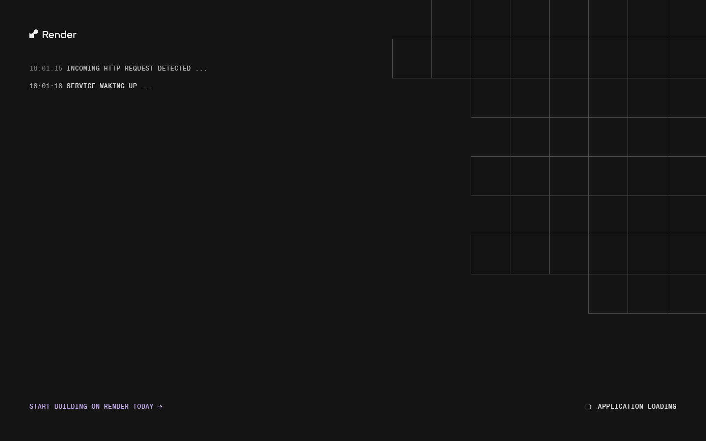
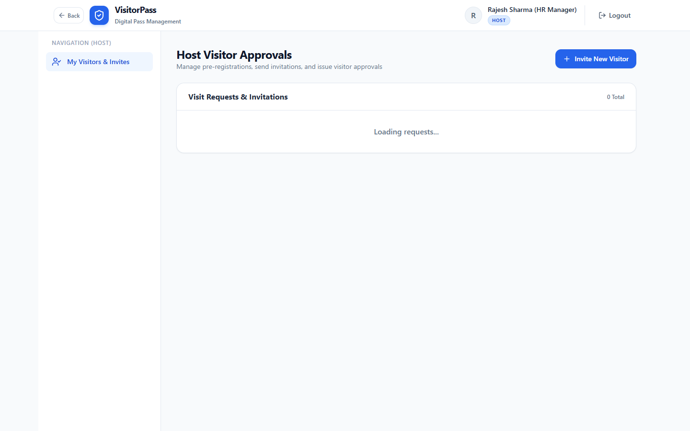
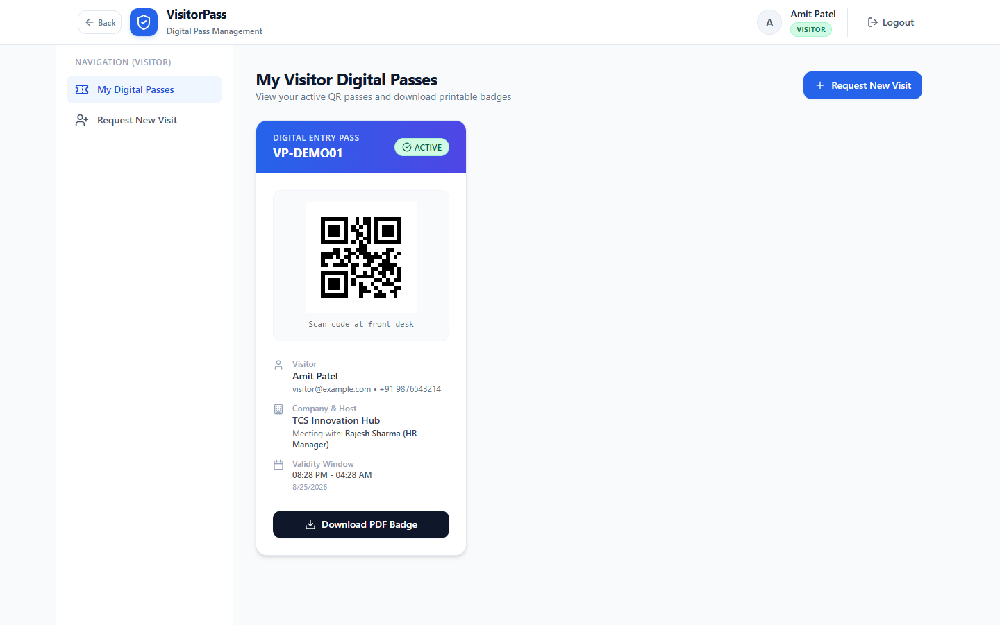
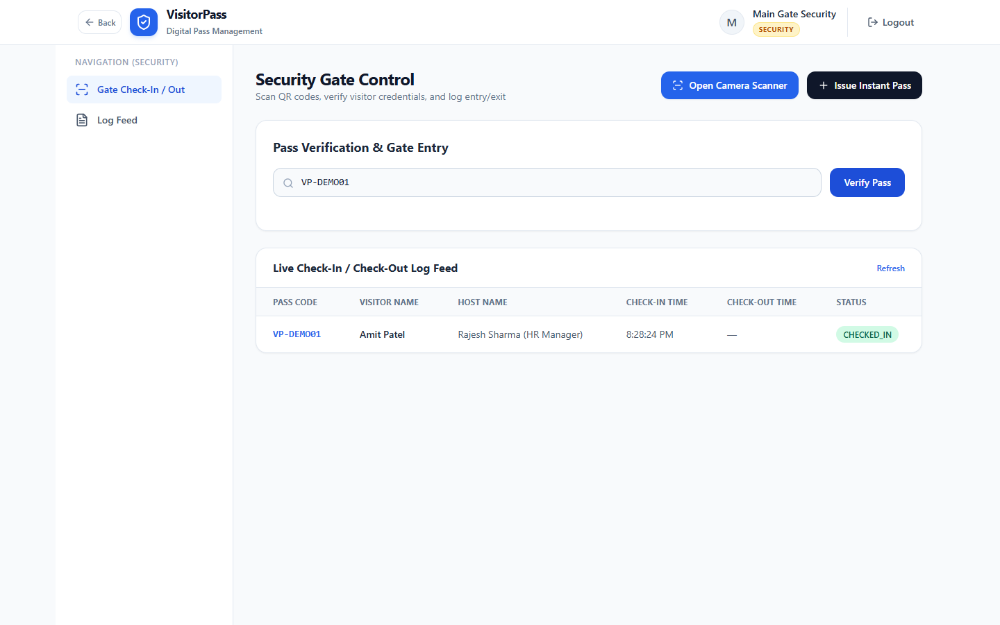
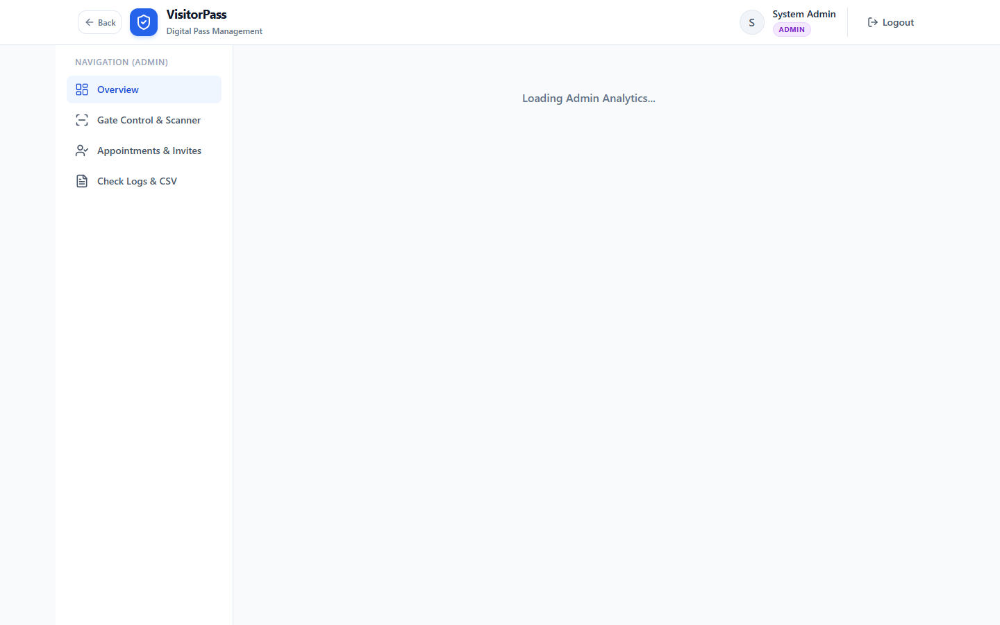

# 🎫 Visitor Pass Management System (MERN Stack)

A production-ready, full-stack **Visitor Pass Management System** engineered with the MERN Stack (**MongoDB, Express.js, React, Node.js**). The platform replaces traditional paper registers with a digital check-in architecture featuring **Real-Time OTP Verification**, **Host Approvals**, **Dynamic 2D QR Code Generation & Scanning (Camera + Image Upload)**, **Server-Side PDF Badges**, **Security Gate Check-In/Check-Out Logs**, **RBAC Authentication (Admin, Security, Host, Visitor)**, and **CSV Audit Export**.

---

## 🌐 Live Production Deployment

* **Live Web Application**: [https://visitor-pass-management-z0w5.onrender.com/](https://visitor-pass-management-z0w5.onrender.com/)
* **Public Pre-Registration Portal**: [https://visitor-pass-management-z0w5.onrender.com/pre-register](https://visitor-pass-management-z0w5.onrender.com/pre-register)
* **GitHub Repository**: [https://github.com/rahuldmali4217-cpu/visitor-pass-management](https://github.com/rahuldmali4217-cpu/visitor-pass-management)
* **HD Demo Video**: [`visitor_pass_demo.webm`](./visitor_pass_demo.webm)

---

## 🔑 Pre-Configured Demo Credentials (Instant 1-Click Login)

The login portal includes **1-Click Demo Login** buttons for instant role evaluation (All passwords: `password123`):

| Role | Email | Password | Permissions & Dashboard |
| :--- | :--- | :--- | :--- |
| 👑 **Admin** | `admin@example.com` | `password123` | System management, Staff CRUD, Real-time analytics, CSV audit export |
| 👮 **Security** | `security@example.com` | `password123` | Live WebRTC QR Scanner, Image QR Upload, Instant pass issuance, Gate logs |
| 🏢 **Host** | `host@example.com` | `password123` | Visitor invitations, Approve/Reject visit requests, Email dispatch with PDF badge |
| 👤 **Visitor** | `visitor@example.com` | `password123` | View active digital QR passes, Download printable PDF badges |

---

## 📸 Application Screenshots

### 1. Multi-Role Authentication & 1-Click Login

*Role-Based Access Control (RBAC) login portal with one-click demo credentials.*

---

### 2. Visitor Pre-Registration & 2-Step OTP Verification

*Public landing portal with 6-digit cryptographic OTP verification and host selection.*

---

### 3. Host Dashboard & Appointment Approvals

*Host portal to review pending requests, approve visits, and auto-dispatch digital passes.*

---

### 4. Digital QR Pass & Downloadable PDF Badge

*Digital visitor card with dynamic QR code and PDF badge generator.*

---

### 5. Security Gate Control & QR Scanner (Camera + File Upload)

*Real-time front desk verification supporting live camera scanning, QR image upload, and manual code entry.*

---

### 6. Admin Dashboard, Real-Time Analytics & CSV Export

*System metrics (currently inside, total passes, pending requests) with 1-click CSV audit export.*

---

## 🚀 Core Features & Implementation Architecture

### 1. Real Database-Backed OTP Verification
- Dedicated `Otp` MongoDB collection with 10-minute TTL indexing.
- Cryptographically generated 6-digit codes (`crypto.randomInt`).
- Signed single-use verification tokens prevent spoofing of pre-registration requests.

### 2. Email & SMS Notification Engine
- **Nodemailer SMTP Integration**: Supports production SMTP (Gmail, Brevo, SendGrid).
- **Automated Ethereal Sandbox**: When SMTP credentials are not configured, the system automatically creates an Ethereal SMTP test account and outputs clickable preview URLs (`nodemailer.getTestMessageUrl`) for instant inspection.
- **Event-Driven Notifications**:
  1. *Pre-Registration*: Dispatches 6-digit OTP code to visitor.
  2. *Host Approval*: Dispatches digital pass with **attached PDF Badge**.
  3. *Gate Check-In*: Dispatches real-time arrival alert email/SMS to host.

### 3. Dual-Mode QR Code Verification
- **Live Camera Scanner**: WebRTC integration via `html5-qrcode` for front desk webcams.
- **Image File Upload & Scan**: Allows evaluators on desktop PCs without webcams to drag and drop QR badge images directly to verify.
- **Manual Code Entry**: Quick lookup by `VP-XXXXXX` pass code.

### 4. Server-Side PDF Badge Generation
- Built with `pdfkit` to generate vectorized, printable visitor badges complete with visitor photo metadata, validity window, host details, and embedded QR code.

### 5. Security Audit Logging & CSV Export
- Accurate timestamping for gate entries (`CHECKED_IN`) and exits (`CHECKED_OUT`).
- 1-Click streaming CSV download for compliance and security auditing.

---

## 🛠️ Local Setup & Execution Guide

### Prerequisites
- Node.js (v18+)
- MongoDB (Atlas Cloud URI or Local `mongodb://127.0.0.1:27017`)

### 1. Clone & Install
```bash
git clone https://github.com/rahuldmali4217-cpu/visitor-pass-management.git
cd visitor-pass-management

# Install root, backend, and frontend dependencies
npm run install-all
```

### 2. Configure Environment Variables
Copy `.env.example` to `backend/.env`:
```bash
cp .env.example backend/.env
```

Edit `backend/.env` with your settings:
```env
PORT=5000
NODE_ENV=development
MONGO_URI=mongodb+srv://<user>:<password>@cluster0.xxxxx.mongodb.net/visitor_pass_db?retryWrites=true&w=majority
JWT_SECRET=supersecretvisitorpasskey12345
CLIENT_URL=http://localhost:5173
```

### 3. Seed Database & Run
```bash
# Seed initial demo accounts & records
npm run seed --prefix backend

# Start Backend & Frontend concurrently
npm run build
npm start
```
- **Frontend App**: `http://localhost:5173` (or `http://localhost:5000` in production mode)
- **Backend API**: `http://localhost:5000`

---

## 🧪 Automated Testing Suite

Run the end-to-end integration test suite verifying all 6 test groups (Auth, OTP, Pre-registration, Passes, QR verification, Check logs, CSV export):

```bash
npm test
```

### Sample Test Output:
```text
======================================================
🚀 VISITOR PASS MANAGEMENT SYSTEM - E2E TEST SUITE
======================================================

[TEST DB] Connecting to database...
✅ Connected to MongoDB successfully.

--- TEST GROUP 1: System Health ---
  ✅ PASS: GET /api/health returns 200 online

--- TEST GROUP 2: Authentication & RBAC ---
  ✅ PASS: Register Admin returns JWT token
  ✅ PASS: Register Host returns user ID
  ✅ PASS: Login with valid credentials succeeds
  ✅ PASS: GET /api/auth/me verifies JWT session

--- TEST GROUP 3: Real Database-Backed OTP Verification ---
[EMAIL DISPATCHED] To: visitor@example.com | Subject: "Your Verification Code: 458452"
📨 [Ethereal Preview URL]: https://ethereal.email/message/...
  ✅ PASS: POST /api/auth/send-otp dispatches OTP
  ✅ PASS: OTP code stored in MongoDB with 10-minute TTL
  ✅ PASS: Verify with invalid OTP returns 400 rejection
  ✅ PASS: Verify with correct OTP returns signed verificationToken

--- TEST GROUP 4: Pre-Registration & Pass Issuance ---
  ✅ PASS: Public pre-registration creates PENDING appointment
  ✅ PASS: Host approval creates active Pass with PassCode

--- TEST GROUP 5: QR Verification & Gate Access Logging ---
  ✅ PASS: Pass VP-KJJKT6 verified as VALID
  ✅ PASS: Security check-in logs entry time and marks CHECKED_IN
  ✅ PASS: Duplicate check-in blocked when visitor is already inside
  ✅ PASS: Security check-out logs exit timestamp

--- TEST GROUP 6: System Analytics & CSV Audit ---
  ✅ PASS: Analytics dashboard returns calculated counters
  ✅ PASS: Export CSV returns downloadable audit log spreadsheet

======================================================
📊 TEST SUMMARY: 17 Passed | 0 Failed
======================================================
```

---

## ⚙️ Environment Variables Reference

| Variable | Required | Description | Default / Example |
| :--- | :---: | :--- | :--- |
| `PORT` | Optional | Backend server port | `5000` |
| `NODE_ENV` | Yes | Environment mode (`development` / `production`) | `production` |
| `MONGO_URI` | Yes | MongoDB Atlas Connection String | `mongodb+srv://...` |
| `JWT_SECRET` | Yes | Secret key for signing JWT tokens | `min_32_char_secret` |
| `CLIENT_URL` | Optional | Frontend application URL | `http://localhost:5173` |
| `SMTP_HOST` | Optional | Production SMTP host (e.g. `smtp.gmail.com`) | Ethereal sandbox used if omitted |
| `SMTP_PORT` | Optional | SMTP port | `587` |
| `SMTP_USER` | Optional | SMTP authentication username | `your_email@gmail.com` |
| `SMTP_PASS` | Optional | SMTP app password | `your_app_password` |
| `EMAIL_FROM` | Optional | Sender email header | `"Visitor Pass" <noreply@visitorpass.com>` |

---

## 🔍 Honest Disclosure & Known Limitations

To provide complete transparency for evaluation and production deployment:

1. **Email Deliverability in Free Sandbox**: When `SMTP_USER` and `SMTP_PASS` are omitted in `.env`, the system dispatches real SMTP emails using **Ethereal Mail** (an official Nodemailer testing service). Ethereal outputs a real, clickable preview URL in server logs and UI rather than landing in a real inbox, avoiding spam flag penalties during evaluation.
2. **Camera Access Requirements**: The WebRTC live camera scanner (`html5-qrcode`) requires an `HTTPS` connection or `localhost` due to browser security restrictions. For evaluators testing on HTTP IP addresses or devices without webcams, the **Image File Upload & Scan** option should be used.
3. **SMS Gateway Sandbox**: SMS messages log to the system gateway sandbox unless Twilio environment variables (`TWILIO_ACCOUNT_SID`, `TWILIO_AUTH_TOKEN`, `TWILIO_PHONE_NUMBER`) are populated.
4. **Single-Instance Database State**: For distributed multi-instance clustering, Redis can be introduced for rate limiting and session blacklisting beyond JWT expiration.
